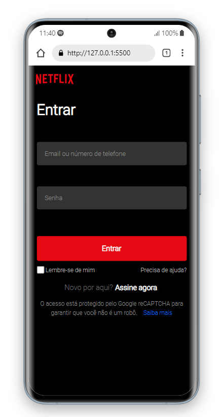
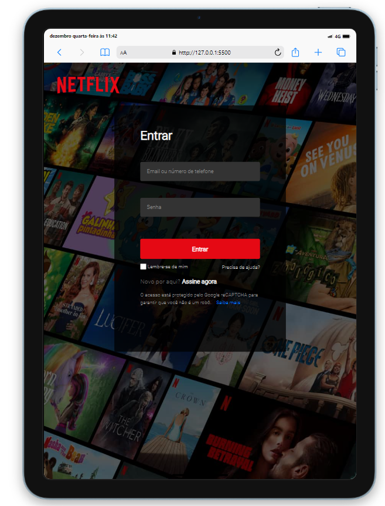

    

<h1 align="center">Clone da tela de login da plataforma NETFLIX</h1>

Página criada com o objetivo de aplicar e aprimorar conhecimentos adquiridos com estudos 
aprofundados em HTML5 e CSS3.

<h3 align="center">Considerando a responsividade como parte vital</h3>

    
    

